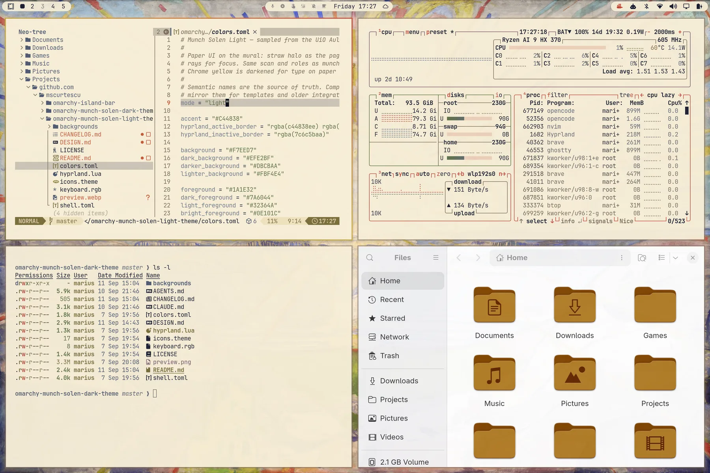
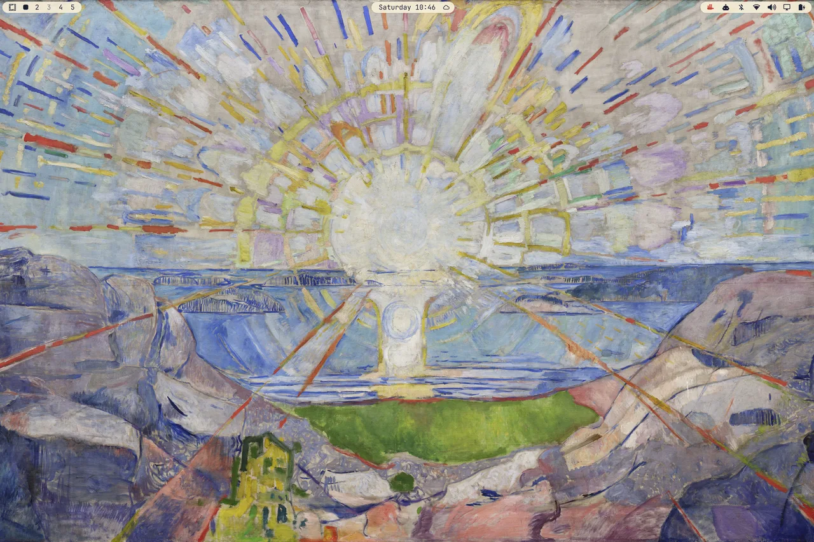
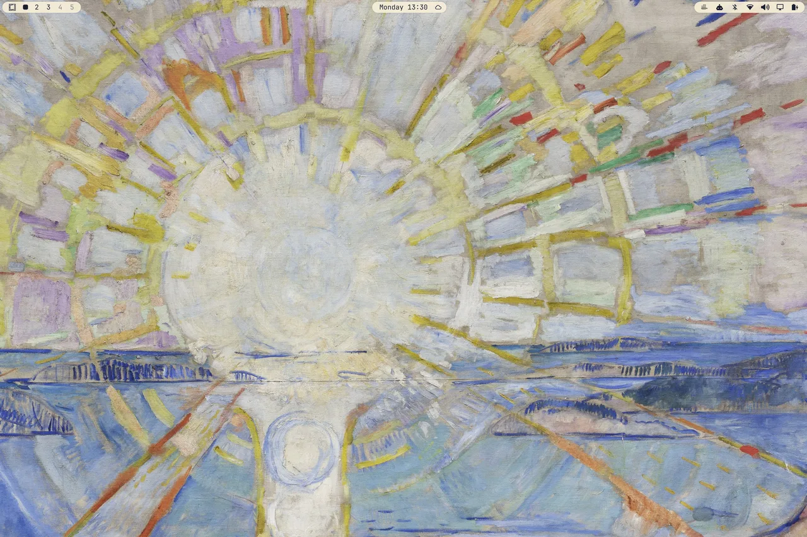
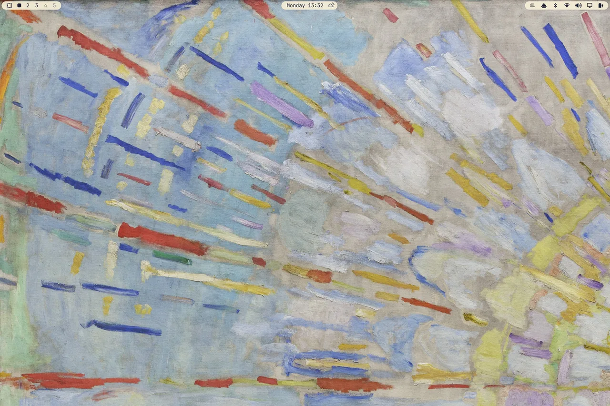

# Munch Solen Light — an Omarchy theme

<a href="https://github.com/tcballard/omarchy-badges"></a>
[](LICENSE)
[](backgrounds/NOTICE)
[](https://omarchy.org)

A light Omarchy theme built from Edvard Munch’s Aula mural *The Sun* (*Solen*, 1911). Straw halo is the page; rock cleft is the ink; cadmium rays mark focus. Design notes: [DESIGN.md](DESIGN.md).



## Install

```bash
omarchy theme install https://github.com/mscurtescu/omarchy-munch-solen-light-theme.git
```

## Palette

| Role | Colour | From the mural |
| --- | --- | --- |
| background | `#F7EED7` | Straw paper |
| surface | `#EFE2BF` | Halo |
| selection | `#EED0BA` | Cadmium wash |
| comment / muted | `#7C6C5B` | Warm earth |
| foreground | `#1A1E32` | Rock cleft |
| bright foreground | `#0E101C` | Deep cleft |
| **accent** | `#C44838` | **Cadmium ray** |
| red | `#B84838` | Ray orange |
| orange | `#C85A38` | Inner spoke |
| yellow | `#7A6E3A` | Chrome yellow, darkened for type |
| green | `#5E7241` | Field / lichen |
| cyan | `#5E6778` | Water |
| blue | `#4F5A72` | Far shore |
| magenta | `#795669` | Violet rock |
| brown | `#7A6044` | Umber cleft |

Semantic roles in `colors.toml` are the source of truth; `color0`–`color15` mirror them. Terminals, Neovim (Aether), btop, Helix, and Chromium are generated from that file on `omarchy theme set`.

## Wallpaper



Same Aula JPEG as the dark sibling (3840×2238, museum frame cropped), plus the same `2-solen-disk.jpg` (sun-disk close-up) and `3-solen-rays.jpg` (ray texture) detail crops — cycle with `omarchy theme bg next`. Cover-scaling on a 3:2 panel crops the sides and keeps the sun. Above: empty desktop with the Island Bar on the mural.

Empty desktops on the detail crops:




This image is **not** MIT — see [Licensing](DESIGN.md#licensing-split).

## See also

- **Sibling theme:** [Munch Solen Dark](https://github.com/mscurtescu/omarchy-munch-solen-dark-theme) — same mural, indigo rock-shadow dark variant.
- **Island Bar:** [mscurtescu/omarchy-island-bar](https://github.com/mscurtescu/omarchy-island-bar) — stock bar as three rounded islands on a transparent strip, visible in the screenshots above.

## License

Original theme files (configs, this README) are MIT. See `LICENSE`. The wallpapers are reproductions of Edvard Munch, *The Sun* (*Solen*), 1911 — photograph © Universitetet i Oslo, [CC BY-NC-SA 4.0](https://creativecommons.org/licenses/by-nc-sa/4.0/); full credit in `backgrounds/NOTICE`. `preview.webp` is a desktop screenshot of the applied theme. Details: [DESIGN.md#licensing-split](DESIGN.md#licensing-split), [DESIGN.md#credits](DESIGN.md#credits).

Issues for both Munch Solen themes live in the [dark repo](https://github.com/mscurtescu/omarchy-munch-solen-dark-theme) (shared beads tracker).
